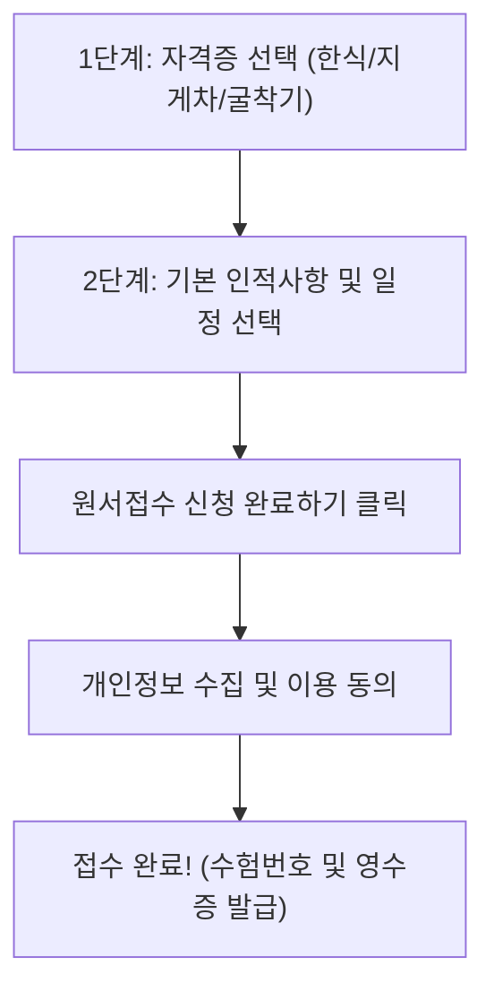

# 📖 두두자격지원센터 웹사이트 사용자 및 관리자 매뉴얼

본 문서는 **두두자격지원센터 3대 국가기술자격(한식조리기능사, 지게차운전기능사, 굴착기운전기능사) 간편 원서접수 시스템**의 화면별 사용 방법 및 관리자 기능 매뉴얼입니다.

---

## 🌐 서비스 접속 주소 및 주요 화면 안내

| 구분 | 접속 URL 경로 | 주요 대상 및 역할 |
| :--- | :--- | :--- |
| **원서접수 메인 포털** | `https://mp1-child.vercel.app/` | 일반 어르신 및 수험생 (간편 원서접수, 내 내역 조회, 챗봇 상담) |
| **접수 관리 대장 (Admin)** | `https://mp1-child.vercel.app/admin/` | 학원 직원 및 관리자 (실시간 접수 목록 조회, 통계, 수정, 엑셀 다운) |
| **안내 규정 관리 (FAQ Admin)** | `https://mp1-child.vercel.app/faq-admin/` | 운영 관리자 (FAQ 지식베이스 23종 규정 관리, 등록, 수정, 삭제) |

> 🔒 **관리자 화면 기본 비밀번호**: `admin`

---

## 1. 👴👵 어르신 친화 편의 기능 (상단 유틸리티 바)

메인 화면 최상단에는 시니어 수험생의 시력과 환경을 고려한 특화 도구가 제공됩니다.

```
[ A+ 글자 크게 ]  [ A- 글자 작게 ]  [ ↺ 원래대로 ]  |  [ ☀️ 밝은 화면 / 🌙 어두운 화면 ]
```

1. **글자 크기 조절**:
   - `A+ 글자 크게`: 화면 내 모든 글씨, 버튼, 안내 문구를 단계별로 확대합니다. (최대 145%)
   - `A- 글자 작게`: 글씨 크기를 축소합니다.
   - `↺ 원래대로`: 기본 글자 크기(100%)로 즉시 복원합니다.
2. **화면 테마 (고대비 모드)**:
   - 기본값으로 가독성이 높은 **밝은 화면(Light Mode)**이 적용되어 있습니다.
   - `🌙 어두운 화면` 버튼을 누르면 눈이 편안한 다크 모드로 실시간 전환되며, 브라우저에 설정이 기억됩니다.

---

## 2. 📝 원서접수 간편 신청 방법 (2단계 완결)

복잡한 인터넷 회원가입이나 공동인증서 로그인 없이 2단계만으로 손쉽게 접수할 수 있습니다.



### [1단계] 준비하시는 자격증 선택
1. 화면 좌측 **1단계 영역**에서 응시하실 자격증 카드 1개를 클릭합니다.
   - 🍳 **1. 한식조리기능사** (음식점 창업 / 단체급식소 조리원)
   - 🚜 **2. 지게차운전기능사** (물류센터 / 유통·제조 현장 필수 면허)
   - 🏗️ **3. 굴착기운전기능사(포크레인)** (토목·건설 현장 평생 기술)
2. **토글 기능**: 선택된 카드를 다시 클릭하면 **선택이 취소(미선택)**됩니다.
3. 자격증을 선택하면 우측 **2단계 요약창**에 선택 종목과 응시수수료가 실시간 반영됩니다.

---

### [2단계] 신청 정보 입력
1. **신청자 성함**: 실명 입력 (한글 2자 이상, 단일 자음/모음 차단).
2. **휴대전화 번호**: 010으로 시작하는 11자리 숫자만 누르면 `010-XXXX-XXXX` 형태로 자동 하이픈이 입력됩니다.
3. **생년월일**:
   - `19650815`와 같이 숫자 8자리를 직접 타이핑하거나,
   - 우측 `📅` 달력 아이콘을 눌러 연도·월·일을 직접 선택할 수 있습니다.
   - *유효 범위: 1900년 1월 1일 ~ 오늘 날짜*
4. **성별 선택**: 남성 / 여성 중 해당하는 버튼을 클릭합니다.
5. **시험 희망 지역 및 교시**:
   - 지역: 전국 8대 권역(서울, 경기, 부산, 대구, 대전, 광주, 강원, 제주) 중 선택
   - 교시: 1부(09:00), 2부(11:00), 3부(13:00), 4부(15:00), 5부(17:00) 중 선택
6. **🎁 응시료 50% 감면 대상자 체크 (해당 시)**:
   - 기초생활수급자, 등록장애인, 국가유공자, 차상위계층에 해당할 경우 체크하면 응시료가 **7,250원(50% 할인)**으로 자동 계산됩니다.
7. **[필수] 원서접수 대행 안내 동의 체크**:
   - 전화/문자 알림 수신 동의 체크박스를 클릭합니다.
8. **[원서접수 신청 완료하기 ➔] 버튼 클릭**.

---

### [최종 확인] 개인정보 동의 및 접수증 발급
1. 팝업으로 표출되는 **개인정보 수집 및 이용 동의서**의 수집 목적과 보유 기간을 확인합니다.
2. 하단 `[동의하고 최종 접수 완료하기]` 버튼을 누릅니다.
3. **접수 완료 영수증 모달**이 열리며, 고유 접수번호(예: `DN2026123456`), 신청자명, 생년월일, 시험장 정보, 결제 금액이 표출됩니다.
4. 접수 완료 즉시 입력 폼은 다음 접수를 위해 깨끗하게 초기화됩니다.

---

## 3. 🔍 내 접수내역 간편조회

이미 접수하신 내역이 정상적으로 등록되었는지 언제든 바로 확인할 수 있습니다.

1. 상단 메뉴의 **`[🔍 내 접수내역 간편조회]`** 버튼을 클릭합니다.
2. **성함**과 **휴대전화 번호(전체 또는 뒷 4자리)**를 입력하고 `[내 접수내역 조회하기]`를 누릅니다.
3. 본인의 접수번호, 응시 종목, 시험 지역, 교시 및 접수 상태(`접수완료`)가 실시간 표출됩니다.

---

## 4. 💬 24시간 실시간 AI 문의 챗봇 사용법

화면 우측 하단의 **파란색 말풍선 아이콘(`💬 문의 챗봇`)**을 누르면 언제든 궁금한 점을 질문할 수 있습니다.

### 주요 질문 예시
- *"한식조리 접수비 얼마예요?"*
- *"포크레인 필기시험 준비물이 뭐예요?"*
- *"지게차 시험 끝나고 합격자 발표는 언제 나와요?"*
- *"시험장에 주차 가능한가요?"*

> 💡 **안내 규정 철저 준수**: 사내 공식 안내 규정에 포함되지 않은 미확인 내용(주차장 무료 여부, 특정 학원 셔틀버스 등)에 대해서는 부정확한 추측(환각)을 방지하고 *"사내 안내 규정에 나와 있지 않아 모르겠습니다"*로 정확하게 안내합니다.

---

## 5. 👨‍💼 관리자 포털 사용법 (`/admin/`)

학원 상담 직원 및 운영 관리자가 접수 현황을 모니터링하고 관리하는 대장 시스템입니다.

### 1) 관리자 로그인
- 상단 메뉴의 `접수 관리 대장` 클릭 또는 `/admin/` 직접 접속
- 비밀번호 입력창에 `admin` 입력 후 로그인

### 2) 상단 실시간 통계 지표
- **총 접수 건수**: 누적 등록된 전체 원서접수 건수
- **⚡ 오늘 신규 접수**: 오늘(KST 기준 당일) 신규 인입된 접수 건수
- **종목별 건수**: 한식조리 / 지게차운전 / 굴착기운전 각각의 실시간 접수량

### 3) 강력한 필터링 및 검색 도구
- `⚡ 오늘 접수만 보기`: 버튼 클릭 한 번으로 당일 접수 건만 즉시 필터링
- `검색창`: 신청자 성함, 휴대전화 번호, 고유 접수번호 실시간 검색
- `종목 필터`:
  - **전체 종목**: DB에 저장된 모든 자격증 내역 표시
  - **지원 종목 3종**: 본 포털에서 접수한 핵심 3종(한식·지게차·굴착기)만 모아보기
  - **개별 종목**: 한식조리기능사, 지게차운전기능사, 굴착기운전기능사 각각 필터링
- `지역 권역 필터`: 서울, 경기, 부산, 대구, 대전, 광주, 강원, 제주 권역별 분류
- `접수상태 필터`: 접수완료 / 접수대기 / 취소·환불

### 4) 실시간 정렬 및 데이터 수정
- **기본 정렬**: 가장 최근에 접수된 신청 내역이 맨 위에 표출됩니다 (`created_at` 내림차순).
- **테이블 헤더 클릭 정렬**: 접수번호, 성함, 자격증, 응시료, 접수일시 등 각 컬럼을 누르면 오름차순/내림차순 정렬됩니다.
- **상세 수정 (`✏️ 수정` 버튼)**:
  - 신청자의 성함, 생년월일, 성별, 연락처, 시험 지역/교시, 접수 상태 수정 가능
  - **관리자 메모 기능**: 어르신과의 유선 통화 내용, 특이사항 기록 및 DB 실시간 저장

### 5) 📥 엑셀(CSV) 다운로드
- 상단의 `[📥 엑셀(CSV) 다운로드]` 버튼을 클릭하면 현재 필터링된 접수 대장 데이터 전체가 UTF-8 한글 인코딩이 적용된 CSV 파일로 즉시 다운로드됩니다.

---

## 6. 📚 안내 규정 지식베이스 관리 (`/faq-admin/`)

챗봇 상담 및 고객 지원 규정을 관리하는 백오피스입니다.

- 상단 메뉴의 `안내 규정 관리` 클릭 (`/faq-admin/`, 비밀번호: `admin`)
- 등록된 **23종 공식 FAQ 항목**을 카테고리별(응시료, 준비물, 일정, 합격발표 등)로 조회
- `[+ 새 안내 규정 등록]`: 새로운 상담 규정 및 FAQ 추가
- `[✏️ 수정] / [🗑️ 삭제]`: 기존 규정 문구 실시간 수정 및 데이터베이스 반영
- `[📥 CSV 다운로드]`: 규정 문서 백업 및 외부 공유

---

## ❓ 자주 묻는 질문 (FAQ & 트러블슈팅)

**Q1. 자격증 선택 카드를 눌렀는데 선택이 안 되거나 해제됩니다.**  
A1. 이미 선택된 카드를 다시 누르면 '선택 취소(토글)'가 작동합니다. 원하시는 자격증 카드를 1번만 클릭해 주시면 파란색 테두리와 `✓ 선택됨` 표시가 뜹니다.

**Q2. 010 번호 입력 시 에러가 발생합니다.**  
A2. 휴대전화 번호는 문자 발송을 위해 반드시 `010`으로 시작하는 11자리 숫자만 허용됩니다. 영문이나 특수문자는 자동으로 입력이 제한됩니다.

**Q3. 시크릿 창이나 모바일에서도 정상 동작하나요?**  
A3. 네, 스마트폰 화면 크기(320px ~ 768px)에 맞춘 반응형 레이아웃이 적용되어 있으며, 모든 브라우저 시크릿 창에서도 정상 접속 및 접수가 가능합니다.
