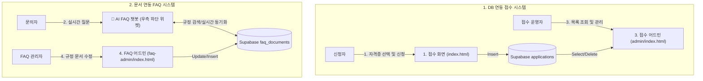

# 🎓 시니어 자격증 접수 & FAQ 서비스 (MP1-Child)

> **두두자격지원센터 운영팀 발주 프로젝트**  
> 50~70대 시니어 응시자를 위한 국가기술자격/전문자격 간편 원서 접수 및 AI FAQ 챗봇 서비스  
> **GitHub 저장소:** [https://github.com/rellion48-crypto/mp1-child](https://github.com/rellion48-crypto/mp1-child)  
> **Vercel 배포 주소:** [https://mp1-child.vercel.app](https://mp1-child.vercel.app)

---

## 📌 1. 프로젝트 개요 (Project Overview)

본 프로젝트는 기존 수기/워드 파일(`접수대장.docx`) 기반의 레거시 원서 접수 업무 프로세스를 **웹 기반 자동화 시스템 및 AI FAQ 챗봇**으로 전환하기 위한 미니 프로젝트입니다.

### 📊 레거시 문제점 및 해결 과제
- **전화 문의 과중**: 하루 약 40통 문의 중 35통 이상이 반복적인 FAQ 질문 (응시료, 일정, 준비물 등).
- **데이터 유실 및 동시성 문제**: 단일 워드 파일 공동 수정 과정에서 덮어쓰기로 인한 신청 내역 유실.
- **직원 오안내 및 비표준화**: 동일 질문에 대한 직원별 설명 불일치 및 불확실한 정보 안내 문제.
- **시니어 용어 격차**: 규정 용어(응시료, 필기, 굴착기 등)와 시니어 사용 용어(접수비, 1차/이론, 포크레인 등) 간의 차이로 인한 답변 실패.

---

## 🌐 2. 주요 배포 주소 3개 & 챗봇 구성 (Public Endpoints)

| 주소 / 화면 | 파일 경로 | 주요 역할 | Supabase 연동 |
|---|---|---|---|
| **1. 접수 사이트** | [`index.html`](file:///c:/dev/MP1/index.html) | 자격증 선택, 신청서 작성 및 제출 | `applications` 테이블 (Insert) |
| **2. 접수 어드민** | [`admin/index.html`](file:///c:/dev/MP1/admin/index.html) | 실시간 접수 목록 조회, 통계 및 관리 | `applications` 테이블 (Select/Delete) |
| **3. FAQ 어드민** | [`faq-admin/index.html`](file:///c:/dev/MP1/faq-admin/index.html) | 사내 규정/FAQ 문서 직접 수정 및 추가 | `faq_documents` 테이블 (CRUD) |
| **🤖 FAQ 챗봇** | [`chatbot.js`](file:///c:/dev/MP1/chatbot.js) | **모든 페이지 우측 하단 상시 노출 플로팅 위젯** | `faq_documents` 동기화 + 시니어 유의어 |

---

## 🏗️ 3. 시스템 아키텍처 (System Architecture)



---

## 🗄️ 4. Supabase 연동 및 SQL 설정 (`supabase_schema.sql`)

Supabase 대시보드의 **SQL Editor**에서 [`supabase_schema.sql`](file:///c:/dev/MP1/supabase_schema.sql)을 실행하여 테이블 및 RLS 정책을 생성합니다.

1. **`applications` 테이블**:
   - `id`: BIGSERIAL (PK)
   - `name`: TEXT (신청자 성함)
   - `phone`: TEXT (연락처)
   - `qualification`: TEXT (자격증 종목)
   - `status`: TEXT (접수 상태)
   - `created_at`: TIMESTAMPTZ (접수 일시)
2. **`faq_documents` 테이블**:
   - `id`: BIGSERIAL (PK)
   - `category`: TEXT (구분 카테고리)
   - `qualification`: TEXT (대상 자격증)
   - `question`: TEXT (질문 제목)
   - `keywords`: TEXT (검색 및 시니어 유의어 키워드)
   - `answer`: TEXT (챗봇 응답 내용)
   - `is_unknown`: BOOLEAN (사내 미확인 항목 강제 거절 플래그)

---

## 📋 5. 취급 자격증 8종 및 접수 규정 (Qualifications & Rules)

| 자격증 | 시행기관 | 접수 방식 | 필기 응시료 | 비고 |
|---|---|---|---|---|
| **한식조리기능사** | 두두자격검정원 | 상시 (CBT) | 14,500원 | 당일 합격 발표 |
| **지게차운전기능사** | 두두자격검정원 | 상시 (CBT) | 14,500원 | 당일 합격 발표 |
| **굴착기운전기능사** | 두두자격검정원 | 상시 (CBT) | 14,500원 | 당일 합격 발표 |
| **전기기능사** | 두두자격검정원 | **정기 (연 4회)** | 14,500원 | 제4회 접수 예정 (08.24~08.27) |
| **요양보호사** | 두두보건시험원 | 상시 | 32,000원 | 교육이수 240시간 수료 필수 |
| **위생사** | 두두보건시험원 | 별도 | 30,000원 | 보건관련학과 이수자 대상 |
| **손해평가사** | 두두자격검정원 | **연 1회 (1차/2차)** | 1차 30,000원 | 2026년 1차 접수 마감 |
| **공인중개사** | 두두자격검정원 | **연 1회 (1차/2차)** | 1차 13,400원 | 2026년 1차 접수 마감 |

---

## 🛡️ 6. 챗봇 가드레일 및 답변 원칙 (Chatbot Guardrails)

1. **필기 접수 범위 한정**:
   - 실기(Practical) 문의 시 $\rightarrow$ `"저희는 필기 접수만 도와드립니다."` 응답.
2. **모르는 내용 엄격 차단 (Hallucination Control)**:
   - 시험장 주차 가능 여부 등 사내 미확인 항목이나 문서에 없는 내용 질문 시 $\rightarrow$ **`"모르겠습니다"`** 답변 필수.
3. **시니어 유사어 사전에 따른 질문 이해 (Synonym Mapping)**:
   - `접수비` / `시험비` / `돈 얼마` $\rightarrow$ **응시료**
   - `1차` / `이론` / `쓰는 거` $\rightarrow$ **필기**
   - `포크레인` $\rightarrow$ **굴착기운전기능사**
   - `요양사` $\rightarrow$ **요양보호사**
4. **문서 수정 즉시 반영**:
   - FAQ 어드민에서 규정을 수정/추가하면 챗봇 답변에 즉시 반영.

---

## 📂 7. 프로젝트 파일 구조 (Directory Map)

```
c:/dev/MP1/
├── index.html                     # [주소 1] 메인 원서접수 페이지 (신청자용)
├── admin/
│   └── index.html                 # [주소 2] 접수 관리 어드민 대장 (운영자용)
├── faq-admin/
│   └── index.html                 # [주소 3] FAQ 및 사내 안내 규정 관리 어드민 (규정 수정용)
├── chatbot.js                     # [챗봇] 우측 하단 상시 노출 플로팅 AI FAQ 챗봇 위젯
├── supabase_schema.sql            # [DB] Supabase 테이블 생성 및 초기 데이터 시딩 스크립트
├── README.md                      # 프로젝트 전수조사 및 종합 가이드
├── MP1_실습가이드.md              # 미니 프로젝트 실습 및 단계별 가이드라인
├── MP1_수행일지.md                # 8/19 ~ 8/20 일차별 진행 상황 및 테스트 결과 기록
└── client-docs/                   # 클라이언트(두두자격지원센터) 제공 원본 자료
    ├── 00_자료출처_안내.md
    ├── 01_사업현황_발주서.md
    ├── 02_안내규정.md
    ├── 두두넷_FAQ_전량.txt
    ├── MP1_발주문서_세트.pdf
    └── 접수대장.docx
```

---

## 📄 8. 제출물 안내 (Submission)

- **제출 기한**: 8/20 (목) 17:00까지
- **제출처**: MLP AI 스튜디오 > 과제 제출 > **미니프로젝트(1)**
- **제출 형식**: 수행일지 PDF (1~2쪽, `MP1_수행일지.md` 작성 후 PDF 변환)
