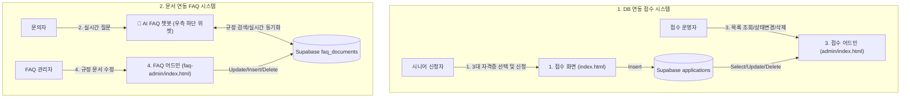

# 🎓 시니어 취업 3대 핵심 국가기술자격 접수 & AI 안내 서비스 (MP1-Child)

> **두두자격지원센터 운영팀 프로젝트**  
> 50~70대 중장년·시니어 응시자를 위한 취업 선호 1위 **3대 핵심 국가기술자격(한식조리, 지게차운전, 굴착기운전기능사)** 간편 원서 접수 및 AI FAQ 챗봇 서비스  
> **GitHub 저장소:** [https://github.com/rellion48-crypto/mp1-child](https://github.com/rellion48-crypto/mp1-child)  
> **Vercel 배포 주소:** [https://mp1-child.vercel.app](https://mp1-child.vercel.app)

---

## 📌 1. 프로젝트 개요 (Project Overview)

본 프로젝트는 복잡한 인터넷 접수와 인증서 발급이 어려운 시니어 응시자를 위해, 취업 수요가 가장 높은 **3대 핵심 국가기술자격(상시 CBT)**에 집중하여 간편한 원서접수 대행 및 24시간 실시간 AI 챗봇 상담을 제공하는 포털 시스템입니다.

### 🎯 3대 핵심 집중 종목
1. **한식조리기능사**: 음식점 창업, 단체급식소 조리원 취업 대표 자격증
2. **지게차운전기능사**: 물류센터, 유통 및 제조 현장 필수 자격 (남녀 중장년 선호 1위)
3. **굴착기운전기능사 (포크레인)**: 토목 공사현장 및 중장비 운전 기술 자격

---

## 🌐 2. 주요 배포 주소 3개 & 챗봇 구성 (Public Endpoints)

| 주소 / 화면 | 파일 경로 | 주요 역할 | Supabase 연동 |
|---|---|---|---|
| **1. 간편 접수 포털** | [`index.html`](file:///c:/dev/MP1/index.html) | 3대 자격증 선택(1단계), 신청서 작성(2단계) 및 실시간 제출 | `applications` 테이블 (Insert) |
| **2. 접수 관리 대장** | [`admin/index.html`](file:///c:/dev/MP1/admin/index.html) | 실시간 접수 목록 조회, 종목별 통계, 상태 변경 및 삭제, 엑셀 다운로드 | `applications` 테이블 (Select/Update/Delete) |
| **3. 안내 규정 관리** | [`faq-admin/index.html`](file:///c:/dev/MP1/faq-admin/index.html) | 사내 규정/FAQ 문서 직접 수정 및 추가, 챗봇 즉시 동기화 | `faq_documents` 테이블 (CRUD) |
| **🤖 AI FAQ 챗봇** | [`chatbot.js`](file:///c:/dev/MP1/chatbot.js) | **모든 페이지 우측 하단 상시 노출 플로팅 위젯** | `faq_documents` 동기화 + 시니어 유의어 + 가드레일 |

---

## 🏗️ 3. 시스템 아키텍처 (System Architecture)

---

## 📋 4. 3대 핵심 국가기술자격 안내 규정 요약

| 항목 | 규정 내용 |
|---|---|
| **대상 종목** | 한식조리기능사, 지게차운전기능사, 굴착기운전기능사 |
| **시행 기관** | 두두자격검정원 |
| **접수 방식** | **상시 운영 (CBT 컴퓨터 시험)** - 정해진 기간 없이 시험장에 빈자리가 있으면 언제든 접수 |
| **필기 응시료** | **14,500원** (3종 동일) |
| **감면 혜택** | 기초생활수급자, 장애인, 국가유공자, 차상위계층 **50% 감면 (7,250원)** |
| **합격자 발표** | **시험 당일 즉시** (시험 종료 버튼 누르는 즉시 모니터에서 점수/합격 확인) |
| **시험 시간대** | 하루 총 5부 (1부 09:00, 2부 11:00, 3부 13:00, 4부 15:00, 5부 17:00) |
| **필기 유효기간**| 합격일로부터 **2년간 필기시험 면제** |
| **환불 규정** | 접수 기간 내 취소 시 **100% 전액 환불**, 접수 마감 후 ~ 시험 5일 전 **50% 환불**, 시험 4일 전부터 **환불 불가** |
| **시험 준비물** | 실물 신분증(주민등록증, 면허증 등), 수험표, 흑색 필기구 (휴대폰 등 전자기기 소지 시 무효) |

---

## 🛡️ 5. 챗봇 가드레일 및 답변 원칙 (Chatbot Guardrails)

1. **실기 접수 거절 원칙**:
   - 질문에 `실기`, `2차`, `실습`, `직접 하는 거` 포함 시 $\rightarrow$ `"저희는 필기 접수만 도와드립니다. 실기 시험 관련 문의는 해당 시행기관으로 문의해 주시기 바랍니다."`
2. **기타 자격증(전기, 요양, 공인중개사 등) 문의 시**:
   - `"저희 센터는 현재 중장년 어르신 취업에 가장 수요가 높은 3대 핵심 국가기술자격(한식조리, 지게차운전, 굴착기운전기능사) 필기 원서접수에 집중하여 전문 지원해 드리고 있습니다."`
3. **모르는 내용 엄격 차단 (Hallucination Control)**:
   - 시험장 주차 가능 여부 등 사내 미확인 항목이나 문서에 없는 내용 질문 시 $\rightarrow$ **`"모르겠습니다"`** 답변.
4. **시니어 유사어 사전에 따른 질문 이해 (Synonym Mapping)**:
   - `접수비` / `시험비` / `돈 얼마` $\rightarrow$ **응시료**
   - `1차` / `이론` / `쓰는 거` $\rightarrow$ **필기**
   - `포크레인` $\rightarrow$ **굴착기운전기능사**
